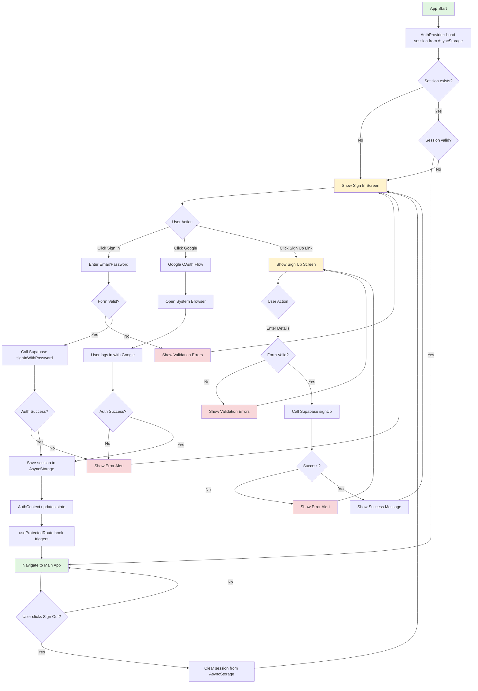

# Authentication Flow

This document describes the authentication flow in the AceBack mobile app.

## User Auth Flow Diagram



## Key Components

### AuthContext

Manages global authentication state:

- **session**: Current Supabase session (null if not authenticated)
- **user**: Current user object (null if not authenticated)
- **loading**: Boolean indicating if auth state is being loaded
- **signOut**: Function to sign out the user

### useProtectedRoute Hook

Handles automatic navigation based on auth state:

```typescript
if (!authenticated && not in auth screens) {
  redirect to /(auth)/sign-in
}

if (authenticated && in auth screens) {
  redirect to /(tabs)
}
```

### Form Validation

**Sign In:**

- Email: Required, valid email format
- Password: Required

**Sign Up:**

- Email: Required, valid email format
- Password: Required, minimum 8 characters
- Confirm Password: Required, must match password

## Authentication Methods

### Email/Password

1. User enters email and password
1. Form validation runs
1. Call `supabase.auth.signInWithPassword()` or `supabase.auth.signUp()`
1. On success, session is saved to AsyncStorage
1. AuthContext updates, triggering navigation to main app

### Google OAuth

1. User clicks "Sign in with Google"
1. Call `supabase.auth.signInWithOAuth({ provider: 'google' })`
1. Opens system browser for Google login
1. After successful login, redirects back to app
1. Session is saved to AsyncStorage
1. AuthContext updates, triggering navigation to main app

## Session Persistence

Sessions are automatically persisted using AsyncStorage:

- **On sign in/sign up**: Session saved to AsyncStorage
- **On app restart**: AuthContext loads session from AsyncStorage
- **On sign out**: Session cleared from AsyncStorage

This allows users to remain signed in across app restarts.

## Error Handling

All authentication errors are caught and displayed to the user via `Alert.alert()`:

- Invalid email format
- Password too short
- Passwords don't match
- Supabase auth errors (wrong password, user not found, etc.)
- Network errors
